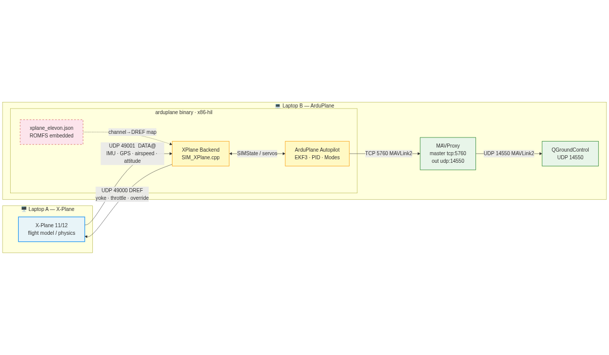
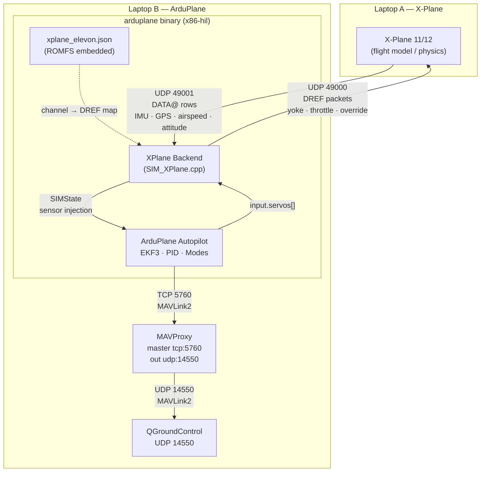

# SITL Setup — ArduPlane x86-hil + X-Plane 11/12

Software-in-the-Loop (SITL) menggunakan firmware `x86-hil` yang berjalan sebagai
binary native di laptop x86.  X-Plane menyediakan flight model; ArduPlane
menjalankan kode autopilot lengkap.  Semua sensor injection dan actuator output
ditangani **di dalam binary SITL** via XPlane backend — tidak diperlukan bridge
script atau hardware Pixhawk.

---

## Arsitektur

### Dua Laptop dalam Satu Jaringan





### Aliran Data

| Arah | Path | Konten |
|------|------|--------|
| X-Plane → ArduPlane | UDP `IP_A` → `IP_B:49001` | DATA@ rows (IMU, GPS, airspeed, attitude) |
| ArduPlane → X-Plane | UDP `IP_B` → `IP_A:49000` | DREF packets (yoke ratio, throttle, override) |
| MAVProxy ↔ ArduPlane | TCP 5760 | MAVLink2 |
| QGC ↔ MAVProxy | UDP 14550 | MAVLink2 telemetry, parameter, misi |

**SITL XPlane backend** (`SIM_XPlane.cpp`) berjalan di dalam binary ArduPlane dan:
- Mendecode DATA@ rows masuk → populate `SIMState` (sensor injection)
- Membaca `input.servos[]` tiap siklus → kirim DREF ke X-Plane
- Menggunakan `xplane_elevon.json` (embedded dalam firmware ROMFS) untuk memetakan
  servo channel ke X-Plane yoke/throttle DREF

---

## Persiapan

### Software yang dibutuhkan — Laptop B

```bash
pip3 install pymavlink MAVProxy
```

- **Firmware**: ArduPlane sudah di-build untuk board `x86-hil`.
  Binary ada di `build/x86-hil/bin/arduplane`.
- **QGroundControl**: sudah terinstall.

### Software yang dibutuhkan — Laptop A

- **X-Plane 11 atau 12**: sudah berjalan, aircraft fixed-wing loaded, sim belum di-pause.

### Cek IP Jaringan

```bash
# Laptop A — catat IP-nya, contoh: 192.168.1.100
ip addr   # Linux
ipconfig  # Windows

# Laptop B — catat IP-nya, contoh: 192.168.1.101
ip addr   # Linux/macOS
```

Pastikan kedua laptop bisa saling ping:
```bash
# dari Laptop B
ping 192.168.1.100   # harus reply
```

---

## Step 1 — Konfigurasi X-Plane (Laptop A)

X-Plane harus mengirim sensor DATA@ ke Laptop B (ArduPlane) dan menerima DREF
dari Laptop B.

**Settings → Net Connections → Data:**

| Field | Value |
|-------|-------|
| Send data to IP | `<IP Laptop B>` (contoh: `192.168.1.101`) |
| Send data port | `49001` |
| Receive commands port | `49000` |

Aktifkan DATA@ rows berikut (**Settings → Data Output**, centang
"Send data over the net"):

| Row # | Nama | Digunakan untuk |
|-------|------|----------------|
| 1 | Frame rate / sim time | timing |
| 3 | Speeds | IAS → airspeed sensor |
| 4 | G-load | body-frame accelerations → IMU |
| 16 | Angular velocities | roll/pitch/yaw rates → gyro |
| 17 | Pitch, roll, heading | attitude → EKF |
| 20 | Lat, lon, altitude | GPS position |
| 21 | Loc, vel, dist | NED velocity → GPS velocity |

> **Catatan**: Setting ini disimpan oleh X-Plane — hanya perlu dilakukan sekali.

---

## Step 2 — Posisikan Aircraft di X-Plane

Home position yang di-embed di firmware adalah **Bandung WICC**:

| Parameter | Nilai |
|-----------|-------|
| `SIM_OPOS_LAT` | `-6.897434` |
| `SIM_OPOS_LNG` | `107.566887` |
| `SIM_OPOS_ALT` | `744.0 m` |
| `SIM_OPOS_HDG` | `108.0°` |

Posisikan aircraft di X-Plane pada koordinat yang sama agar EKF dapat konvergen.
Di X-Plane: **Location → Set Aircraft Position** → masukkan koordinat di atas.

---

## Step 3 — Jalankan ArduPlane SITL (Laptop B)

### 3.1 — Cari IP Laptop A (X-Plane)

Jalankan perintah berikut **di Laptop A** untuk mendapatkan IP-nya:

```bash
# Linux / macOS
ip addr show | grep "inet " | grep -v 127.0.0.1
# atau
hostname -I

# Windows
ipconfig | findstr "IPv4"
```

Catat IP-nya, contoh: `192.168.1.x` dimana `x` adalah oktet terakhir
(misalnya `192.168.1.5`).

### 3.2 — Jalankan binary ArduPlane

Buka terminal baru di **Laptop B**, ganti `192.168.1.x` dengan IP Laptop A:

```bash
cd /path/to/drone-kamikaze

./build/x86-hil/bin/arduplane --model xplane:192.168.1.x --serial0 tcp:0 --home -6.897434,107.566887,744,108
```

**Contoh nyata** jika IP Laptop A adalah `192.168.1.5`:

```bash
./build/x86-hil/bin/arduplane --model xplane:192.168.1.5 --serial0 tcp:0 --home -6.897434,107.566887,744,108
```

### 3.3 — Penjelasan flag

| Flag | Nilai | Fungsi |
|------|-------|--------|
| `--model` | `xplane:192.168.1.x` | Aktifkan XPlane backend; `192.168.1.x` adalah IP X-Plane |
| | | ArduPlane akan kirim DREF ke `192.168.1.x:49000` |
| | | ArduPlane listen DATA@ dari X-Plane di UDP `49001` |
| `--serial0` | `tcp:0` | Buka MAVLink TCP server di port `5760` |
| | | MAVProxy dan QGC connect ke port ini |
| `--home` | `lat,lon,alt,heading` | Set home / EKF origin; format derajat desimal, altitude MSL (m), heading (°) |
| | `-6.897434,107.566887,744,108` | Lokasi default proyek ini (Bandung, 744 m AMSL, heading utara) |

### 3.4 — Output yang diharapkan

Saat startup normal:
```
Waiting for XPlane data on UDP port 49001 and sending to port 49000
```

Setelah X-Plane di-unpause dan data mulai masuk:
```
Connected to 192.168.1.x:49000
```

> **Jika `Connected to` tidak muncul**: pastikan X-Plane sudah di-unpause
> dan net config-nya sudah benar (IP Laptop B, port 49001).

Biarkan terminal ini tetap berjalan.

---

## Step 4 — Jalankan MAVProxy (Laptop B)

Buka terminal baru di Laptop B:

```bash
mavproxy.py \
    --master tcp:127.0.0.1:5760 \
    --out udp:127.0.0.1:14550 \
    --out udp:0.0.0.0:14551 \
    --sitl 127.0.0.1:5502
```

| Opsi | Fungsi |
|------|--------|
| `--master tcp:127.0.0.1:5760` | Connect ke ArduPlane SITL |
| `--out udp:127.0.0.1:14550` | Forward ke QGC (lokal) |
| `--out udp:0.0.0.0:14551` | Forward ke GCS lain / remote jika diperlukan |

Biarkan terminal ini tetap berjalan.

---

## Step 5 — Connect QGroundControl (Laptop B)

Buka **QGroundControl**.

QGC akan auto-detect MAVLink di UDP 14550. Jika tidak auto-connect:

**Application Settings → Comm Links → Add:**

| Field | Value |
|-------|-------|
| Type | UDP |
| Listening Port | `14550` |

Anda akan melihat:
- Vehicle connected (ArduPlane)
- Parameters loaded
- Flight mode (MANUAL atau sesuai default)

---

## Step 6 — Unpause X-Plane

Tekan **P** (atau klik tombol pause) di X-Plane untuk memulai simulasi.

Setelah unpause:
- ArduPlane mulai menerima DATA@ dari X-Plane dan menginjeksi sensor data
- EKF3 inisialisasi (GPS fix terlihat di QGC dalam beberapa detik)
- DREF packets mengalir dari ArduPlane ke X-Plane ~25 Hz

### Verifikasi

Di QGC anda harus melihat:
- GPS position sesuai lokasi aircraft di X-Plane
- Attitude (roll/pitch/heading) sesuai dengan cockpit X-Plane
- Airspeed update saat kecepatan X-Plane berubah

Di terminal ArduPlane:
```
Connected to 192.168.1.100:49000
```

---

## Step 7 — Arm dan Terbang

Arm via QGC (Safety → Arm) atau MAVProxy:

```
mavproxy> arm throttle
```

Ganti flight mode via QGC atau MAVProxy:

```
mavproxy> mode AUTO
mavproxy> mode MANUAL
mavproxy> mode TRACKING
```

---

## Parameter Default

Semua parameter yang diperlukan ada di `defaults.parm` yang embedded dalam
firmware dan diterapkan otomatis pada EEPROM bersih.

| Parameter | Nilai | Tujuan |
|-----------|-------|--------|
| `GPS1_TYPE` | 100 | SITL GPS backend (baca dari SIMState / X-Plane) |
| `ARSPD_TYPE` | 100 | SITL airspeed backend |
| `AHRS_EKF_TYPE` | 3 | EKF3 (x86 tidak ada limitasi STM32F427) |
| `EK3_ENABLE` | 1 | Aktifkan EKF3 |
| `EK2_ENABLE` | 0 | Nonaktifkan EKF2 |
| `BRD_SAFETY_DEFLT` | 0 | Tidak ada safety switch di simulasi |
| `ARMING_SKIPCHK` | -1 | Skip semua pre-arm check |
| `THR_FAILSAFE` | 0 | Nonaktifkan RC/throttle failsafe |
| `RC_OVERRIDE_TIME` | -1 | Tidak ada timeout pada RC override |
| `SIM_SPEEDUP` | 1 | Realtime 1× |
| `SIM_OH_MASK` | 255 | Pass semua servo channel ke SITL |
| `TKOFF_THR_MINACC` | 0 | Tanpa cek akselerasi sebelum throttle-up |
| `TKOFF_THR_MINSPD` | 0 | Tanpa cek kecepatan GPS sebelum throttle-up |
| `GROUND_STEER_ALT` | 5 | Ground steering aktif di bawah 5 m AGL |
| `TKOFF_ROTATE_SPD` | 12 | Rotate (pitch up) pada 12 m/s |

> Tidak ada `SCHED_LOOP_RATE` limit — x86 dapat menjalankan scheduler di 400 Hz.
> Tidak ada PPP/NET — XPlane backend menggunakan UDP socket langsung.

### TRACKING Parameters

| Parameter | Default | Keterangan |
|-----------|---------|-----------|
| `TRAK_ROLL_P` | 200 | cd per derajat error horizontal |
| `TRAK_ROLL_I` | 10 | integral roll |
| `TRAK_ROLL_D` | 5 | derivative roll |
| `TRAK_PTCH_P` | 100 | cd per derajat error vertikal |
| `TRAK_PTCH_I` | 500 | integral pitch |
| `TRAK_PTCH_D` | 0 | derivative pitch |
| `TRACKING_MAX_DEG` | 3.0 | maksimum delta roll/pitch saat error ±1 (derajat) |
| `TRACKING_DBAND` | 0.573 | deadband error sebelum masuk PID (derajat, ~0.01 rad) |
| `TRACKING_TIMEOUT` | 1000 | timeout sinyal tracking sebelum hold level (ms) |

### DREF Mapping (`xplane_elevon.json`)

Firmware x86-hil embed `xplane_elevon.json` yang memetakan servo channel ke
X-Plane DREFs untuk flying-wing elevon (misal FX-61 Phantom):

| Channel | ArduPlane | DREF X-Plane | Tipe |
|---------|-----------|-------------|------|
| CH1 | Right elevon PWM (pre-mixed) | `sim/joystick/yoke_roll_ratio` | elevon_roll |
| CH2 | Left elevon PWM (pre-mixed) | `sim/joystick/yoke_pitch_ratio` | elevon_pitch_neg |
| CH3 | Throttle | `sim/flightmodel/engine/ENGN_thro_use[0]` | range |

ArduPlane melakukan elevon mixing sebelum output (mode `plane-elevon`):
```
roll  = (CH1 - CH2) / 1000        → yoke_roll_ratio   [−1, +1]
pitch = (CH1 + CH2 - 3000) / 1000 → yoke_pitch_ratio  (negated)
```

---

## Perbedaan SITL vs HITL

| Aspek | HITL (fmuv3-hil) | SITL (x86-hil) |
|-------|-----------------|----------------|
| Hardware | Pixhawk v2 (STM32F427) | Laptop x86 |
| Koneksi X-Plane | USB-UART → PPP tunnel | UDP langsung (LAN) |
| MAVLink ke QGC | USB (SERIAL0) | TCP 5760 |
| EKF | EKF2 (STM32 limitation) | EKF3 |
| Scheduler | 50 Hz (watchdog limit) | 400 Hz |
| Logging | Tidak (no SD card) | Enabled (disk) |
| PPP diperlukan | Ya | **Tidak** |

---

## Troubleshooting

| Gejala | Kemungkinan Penyebab | Solusi |
|--------|---------------------|--------|
| `Waiting for XPlane data` tidak berubah | X-Plane belum mengirim data | Pastikan IP Laptop B benar di X-Plane net config; pastikan X-Plane di-unpause |
| `Connected to ...` tidak muncul | Firewall memblokir UDP 49001 | Buka port 49001 UDP di firewall Laptop B |
| QGC tidak connect | MAVProxy belum jalan / port salah | Pastikan MAVProxy berjalan dan QGC listen di UDP 14550 |
| GPS tidak ada di QGC | EKF belum konvergen | Pastikan `SIM_OPOS_*` sesuai lokasi X-Plane; tunggu beberapa detik setelah unpause |
| Kontrol tidak bergerak di X-Plane | DREF tidak sampai ke X-Plane | Periksa IP X-Plane di `--model xplane:IP`; cek firewall Laptop A port 49000 |
| Throttle tetap 0 saat armed | RANGE DREF di-zero saat disarmed | Ini by design — arm dulu baru throttle |
| Tidak bisa arm | Pre-arm check gagal | Pastikan `ARMING_SKIPCHK -1` loaded; cek parameter via MAVProxy `param show ARMING_SKIPCHK` |
| Takeoff AUTO tidak jalan | Throttle gate belum clear | Pastikan `TKOFF_THR_MINSPD 0`, `TKOFF_THR_MINACC 0` |
| X-Plane controls kaku / tidak responsif | Data rate rendah | Pastikan DATA@ rows aktif di X-Plane, terutama row 16, 17 |
| Build gagal `redefinition of 'param_union'` | Header MAVLink duplikat di source tree | Jalankan `python3 fix_mavlink_headers.py` lalu `./waf distclean && ./waf configure --board x86-hil && ./waf plane` |

---

## Build Firmware

Jika perlu rebuild dari source:

```bash
cd /path/to/drone-kamikaze

# Configure board x86-hil
python modules/waf/waf-light configure --board x86-hil

# Build ArduPlane
python modules/waf/waf-light plane

# Binary ada di:
# build/x86-hil/bin/arduplane
```

### Patch sebelum build (wajib setelah clone atau reset submodule)

Script `fix_mavlink_headers.py` menerapkan dua fix sekaligus:

| Fix | Masalah | Solusi |
|-----|---------|--------|
| **1** | `libraries/GCS_MAVLink/include/` ada di source tree (tidak ter-track git) → `redefinition of 'param_union'` | Hapus folder tersebut |
| **2** | `TRACKING_MESSAGE` (ID 11045) tidak ada di upstream `ardupilotmega.xml` → pesan dibuang diam-diam oleh `mavlink_get_msg_entry()` | Apply `fix_mavlink_tracking_message.patch` ke submodule mavlink |

```bash
# Jalankan dari root repo ardupilot
python3 fix_mavlink_headers.py

# Cek status saja tanpa mengubah apapun
python3 fix_mavlink_headers.py --check

# Kemudian rebuild
./waf distclean
./waf configure --board x86-hil
./waf plane
```

File patch: [`fix_mavlink_tracking_message.patch`](fix_mavlink_tracking_message.patch)

---

## Reset Parameter

Jika parameter stale dari sesi sebelumnya:

```
# Via MAVProxy
param set FORMAT_VERSION 0
reboot
```

Atau via QGC: **Parameters → Tools → Reset all to defaults**

---

## Menghentikan Sesi

1. Disarm via QGC atau `mavproxy> disarm`.
2. Pause X-Plane (`P`).
3. `Ctrl+C` terminal ArduPlane.
4. `Ctrl+C` terminal MAVProxy.
5. Tutup QGroundControl.
